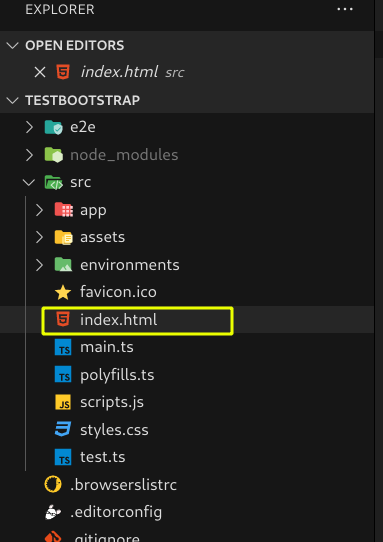
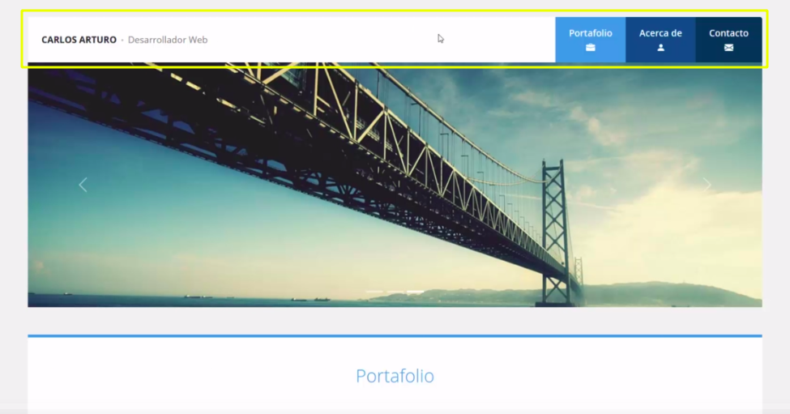
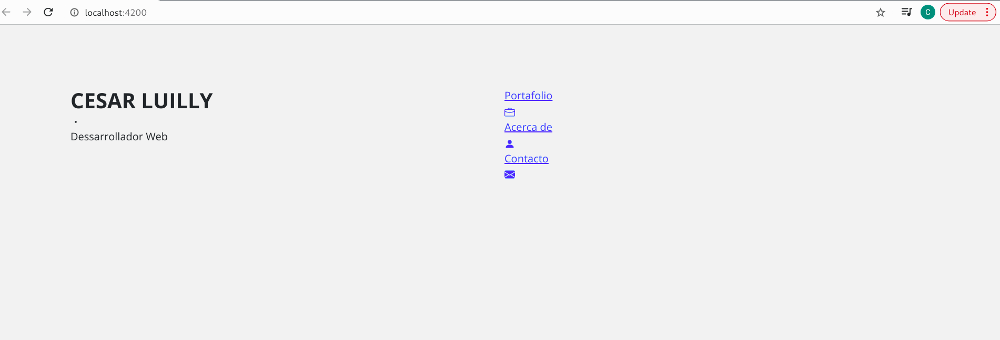
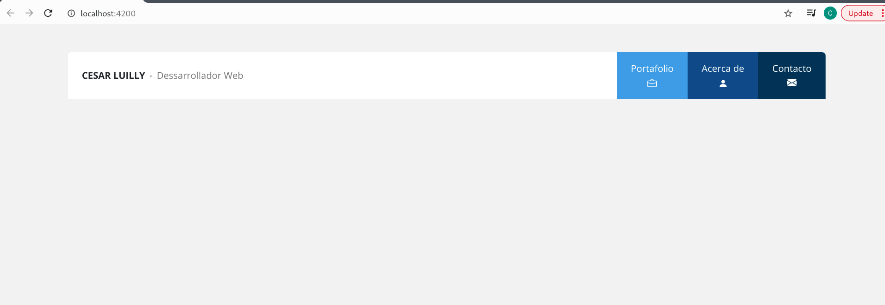
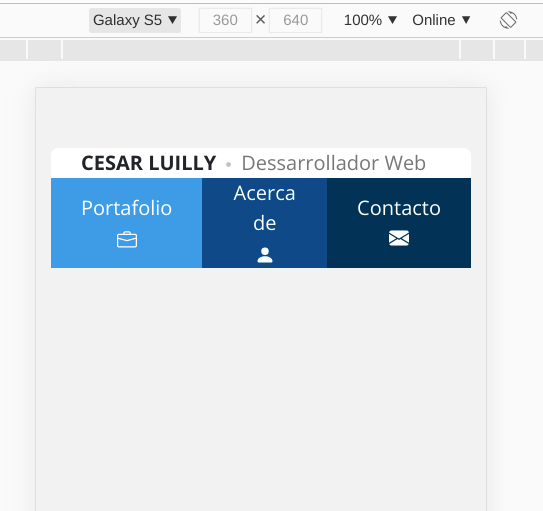

# UDY-Bootstrap

## Paso para creal el Portafolio
> ### Video 65 - Encabezado
* Agrego las fuentes de Opens Sans de Ligh, regular, Bold (300, 400, 600, 700) al Index y en el css lo referencio.

* Encabezado Original a diseñar

* Creo la escructura del encabezado(Esqueleto) sin css
    * Ver commit https://github.com/cesarluilly/UDY-Bootstrap/commit/ac95010d294880bcc9a941505bd5e9f60ee80400

    * 

* Codigo terminado y presentacion del encabezado
    * **Desktop** 

    * **Mobile** 

> ### Video 66 - Slideshow

> ### Video 67 - Galeria de trabajos (Parte I)

> ### Video 68 - Galeria de trabajos (Parte II) - Diseño Responsive

> ### Video 69 - Galeria de trabajos (Parte III) - Codigo Javascript de la galeria

> ### Video 70 - Seccion de acerca de

> ### Video 71 - Formulario de contacto

> ### Video 72 - Pie de pagina

